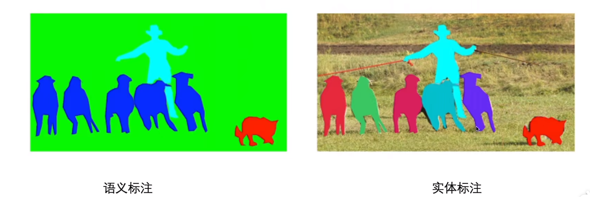
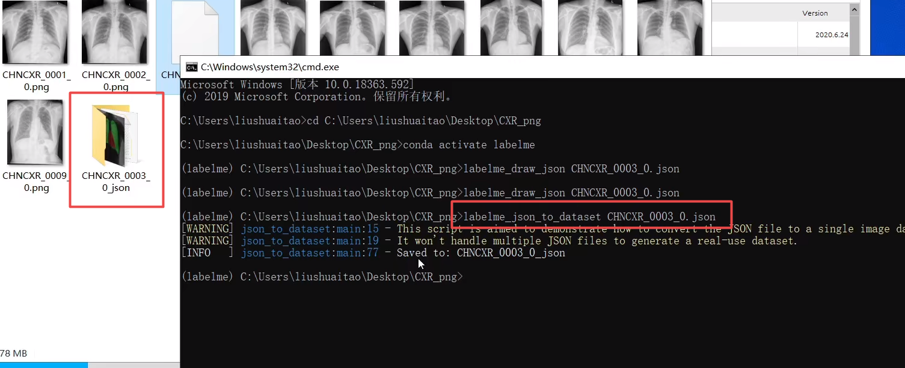
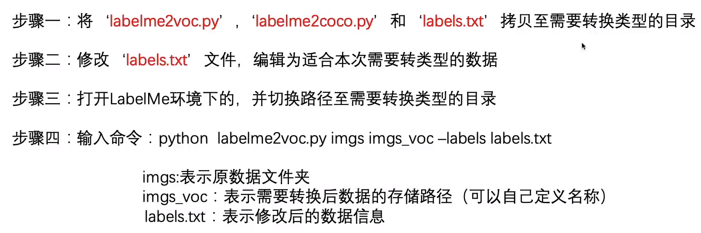
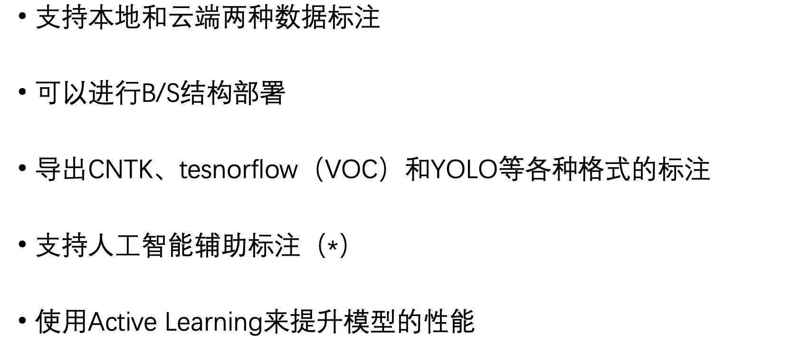
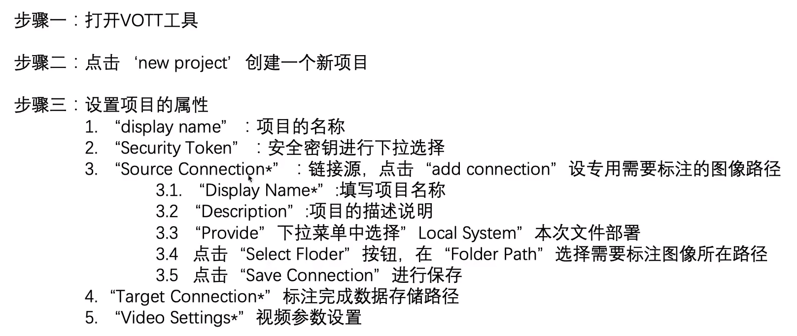
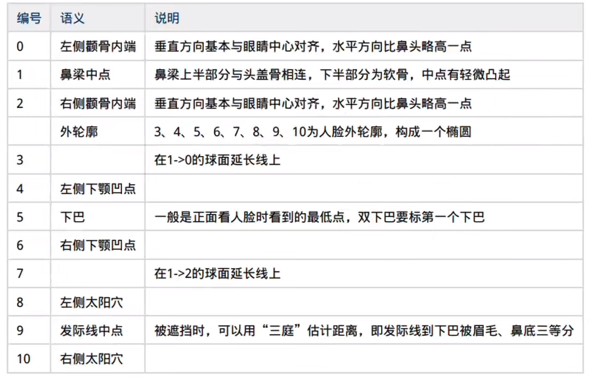
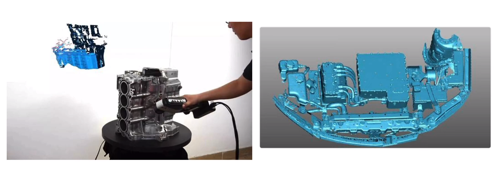
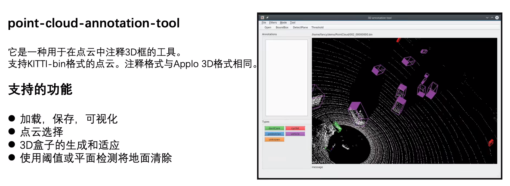

# 一、数据标注

## 数据标注的定义

数据标注专注于AI领域，为人工智能行业提供数据采集、数据清洗、数据标注等数据类服务。

## 数据标注的获取方式

1. 人工数据标注：标注结果可靠
2. 自动数据标注：一般需要二次复核
3. 外包数据标注：很多时候面临数据泄密与流失


## 数据标注工具

主流标注工具（免费）：
1. LabelMe工具：json数据格式，矩形标注、多边形标注
2. LabelImg工具：xml数据格式，yolo数据格式
3. VOTT工具：微软，Web工具，针对图像、视频都可以标注
4. Yolo_Mark工具（团队）
5. 精灵（Colabeler）标注工具：国内，支持中文

其他标注工具（付费）：
1. CVAT（OpenCV）
2. VIA-VGG Image Annotator：兼容性不好
3. LabelBox：html、js..写的
4. PixelAnnotationTool工具：分割

> 区别：主流和其他工具区别不在于标注的方式，在于付费标注工具含有一些如工程管理、团队合作、数据标注流程管理等功能

## LabelMe的两种启动方式

> 以**分类** 方式启动`LabelMe`！

1. 分类标注
```python
labelme --flags 种类1,种类2,种类3
```

> 例如：有100张肺部照片，里面health、sicken和unknown三种类别，第一张图片是health，第二张图片是sicken，然后我用矩形框或者多边形标注出发病位置，第三张是unknown...

2. 文本标注
```python
labelme --flags 文本.txt
```

文本.txt：
```html
health
sicken
unknown
```

## 实体分割与语义分割区别



> [知乎：【图解AI】什么是语义分割、实例分割、全景分割](https://zhuanlan.zhihu.com/p/368904941)

## LabelImg的安装使用

默认的[LabelImg.exe](https://github.com/tzutalin/labelImg/releases) 是不支持中文路径使用的，但是[labelImg-plus](https://github.com/WangRongsheng/KDAT/tree/main/labelImg-plus) 是支持中文路径的！

## LabelMe的数据查看方式

- `labelme_draw_json`：查看json格式的标注
- `labelme_json_to_dataset`：将json文件转化为一组图像和标签文件
- `labelme_draw_label_png`：装载标记文件





## 遥感数据

遥感影像（简称RS）是指记录各种地物电磁波大小的胶片或者照片，主要分为航空像片（无人机）和卫星像片。

特点：
1. 文件尺寸大，单幅往往超过100M。
2. 数据成果的分幅问题，普通图像直接可以导出标注结果，但是遥感图片的标注结果想要被深度学习算法使用，必须经过分幅处理。
3. 单幅数据量大，标注工作复杂。

## LabelMe标注遥感数据

劣势：
- labelme标注大文件资源数据时，加载慢，性能差
- labelme针对倾斜物体或不规则物体无法标注（当然可以使用多边形标注解决）

解决方法：使用其他遥感数据标注工具：`RSLabel`

## RSLabel标注遥感数据

优势：
1. 支持倾斜物体的旋转标注
2. 对于大的遥感数据图像可以生成缩略图（金字塔）

安装：
[提取码: 7ius](https://pan.baidu.com/s/1pCNTR1VEdxWLYP6BzHyEqA)

## 标注数据格式解析

### PASCAL VOC


### MS COCO

！[](./images/7.png)

## LabelMe标注遥感数据生成VOC数据



> 代码在[labelme/examples/bbox_detection](https://github.com/wkentaro/labelme/tree/main/examples/bbox_detection)

## 人脸标注

标注类别：情绪、性别、戴帽、发型...

人体肖像分割

人脸特征-点标注（正面-68点，侧面39点）

## VOTT标注工具

特点：


安装：[Github：VOTT](https://github.com/microsoft/VoTT)

导入：


## 使用LabelMe人像标注-点标注



## 精灵标注

[http://www.jinglingbiaozhu.com/](http://www.jinglingbiaozhu.com/)


视频标注：视频追踪

## 3D点云数据

什么是3D点云数据？
- 点云数据是扫描资料以点的形式记录
- 每一个点包含三维坐标
- 有些可能含有颜色信息或反射强度信息

什么是3D传感器？
3D广电传感器是在计算机成像、合成孔径成像运用的传感器。



为什么需要3D点云？
需要更高效的信息。

3D点云数据的应用场景？
- 自动驾驶
- 游戏开发
- 考古及文物保护计划
- 规划设计

3D点云的标注工具：
1. PCAT标注工具：[https://github.com/springzfx/point-cloud-annotation-tool](https://github.com/springzfx/point-cloud-annotation-tool)



2. PCAT_open_source标注工具：[https://github.com/halostorm/PCAT_open_source](https://github.com/halostorm/PCAT_open_source)
3. semantic-segmentation-editor

## 旋转目标标注

[https://github.com/cgvict/roLabelImg](https://github.com/cgvict/roLabelImg)
